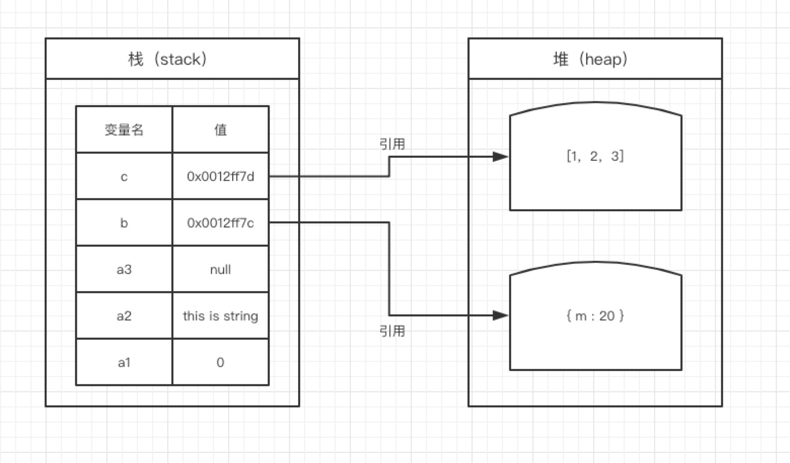

>由于js的内存回收机制，一般不会怎么关注内存这个东西。学过计算机基础都知道，运算的数据是存在内存空间的

1. js的内存空间分为栈内存和堆内存
简单来说基础数据类型存在栈内存，引用类型存在堆内存，而堆内存是不能直接访问的

访问堆内存中的引用数据类型时，实际上我们首先是从栈中获取了该对象的地址引用（或者地址指针），然后再从堆内存中取得我们需要的数据

    ```
    var a1 = 0;   // 栈 
    var a2 = 'this is string'; // 栈
    var a3 = null; // 栈

    var b = { m: 20 }; // 变量b存在于栈中，{m: 20} 作为对象存在于堆内存中
    var c = [1, 2, 3]; // 变量c存在于栈中，[1, 2, 3] 作为对象存在于堆内存中
    ```
引用类型的复制其实就是栈中的对象的地址的复制


2. 事件循环机制
这部分其实可以参考之前的[js事件机制](../js/run)
微任务和宏任务
    - 都是属于队列，而不是放在栈中
    - setTimeout的作用是等待给定的时间后为它的回调产生一个**新的**宏任务
    - 微任务通常来说就是需要在当前 task 执行结束后立即执行的任务,这就是为啥promise中的代码会比setTimeout先执行
    - 如果在微任务执行期间微任务队列加入了新的微任务，会将新的微任务加入队列尾部，之后也会被执行
```
console.log('1');

setTimeout(function() {
    console.log('setTimeout');
}, 0);

Promise.resolve().then(function() {
    console.log('promise1');
}).then(function() {
    console.log('promise2');
});
```
>console.log('2');
>1
>2
>promise1
>promise2
>setTimeout