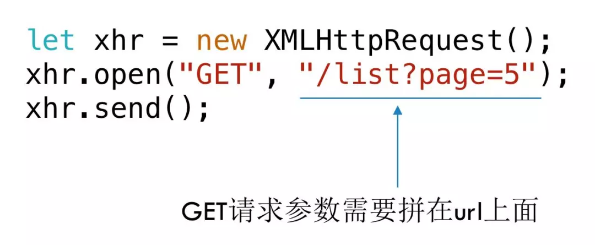
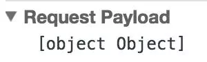
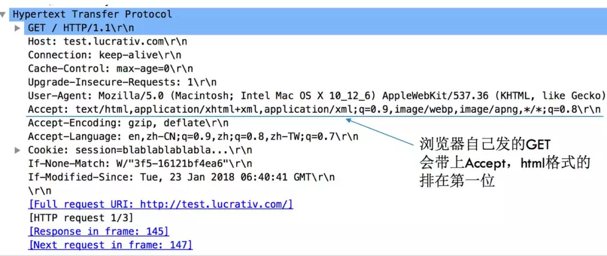

### GET请求
使用原生js写一个GET请求
```js
let xhr = new XMLHttpRequest();
xhr.open("GET", "/list");
xhr.send();
```
如果需要加上请求参数，则需要拼接请求url

同时需要对参数进行转义，encodeURIComponent() 函数将转义用于分隔 URI 各个部分的标点符号
```js
function ajax (url, data) {
    let args = [];
    for (let key in data) {
        // 参数需要转义
      args.push(`${encodeURIComponent(key)} = ${encodeURIComponent(data[key])}`);
    }
    let search = args.join("&");
    // 判断当前url是否已有参数
    url += ~url.indexOf("?") ? `&${search}` : `?${search}`;

    let xhr = new XMLHttpRequest();
    xhr.open("GET", url);
    xhr.send();
}
```
### POST请求
POST请求的参数就不是放在url了，而是放在send里面，即请求体
```js
let xhr = new XMLHttpRequest();
xhr.open('POST', '/list');
xhr.send('page=5&pageSize=20');
```

### Content-Type
1. application/x-www-form-urlencoded
一种最常用的一种请求编码方式，支持GET/POST等方法，特点是：所有的数据变成键值对的形式key1=value1&key2=value2的形式，并且特殊字符需要转义成utf-8编号，如空格会变成%20。最终发送的内容转为字符串
```js
let xhr = new XMLHttpRequest();
xhr.open('POST', '/add');
xhr.setRequestHeader('Content-type', 'application/x-www-form-urlencoded');
xhr.send({id:5, name:'tom'});
```

1. application/json
要求格式为json。如果请求数据结构比较简单应该是使用常用的urlencoded比较有利，而比较复杂时使用json比较有利。通常来说比较常用的还是urlencoded
```js
let xhr = new XMLHttpRequest();
xhr.open("POST", "/add");
xhr.setRequestHeader("Content-type", "application/json");
let data = {id:5, name: "yin"};
xhr.send(JSON.stringify(data));
```

1. multipart/form-data
它通常用于上传文件，上传文件必须要使用这种格式
```js
let formData = new FormData();
formData.append("id", 5); // 数字5会被立即转换成字符串 "5"
formData.append("name", "#yin");
formData.append("file", input.files[0]);// 上传文件
let xhr = new XMLHttpRequest();
xhr.open("POST", "/add");
xhr.send(formData);
```

### 浏览器发送GET和js发送get请求

<br>
使用地址栏访问的和使用ajax的get请求本质上都是一样的，只是使用ajax我们可以设置http请求头，而使用地址栏访问的是由浏览器添加默认的请求头.浏览器自己发的GET有一个明显的特点，它会设置http请求头的Accept字段，并且把text/html排在第一位，即它最希望收到的是html格式

### 请求相应状态码
1. 301永久转移
    - 更换域名，浏览器收到301之后，就会自动跳转了
    - 希望访问http的时候自动跳转到https也是可以用301
        ```js
        server {
            listen       80; 
            server_name  fed.renren.com;

            if ($scheme != "https") {
                return 301 https://$host$request_uri;
            }   
        }
        ```
1. 302 Found资源暂时转移
    - 很多短链接跳转长链接就是使用的302
1. 304 Not Modified没有修改
    - 服务会计算当前文件的etag，它是一个文件的哈希值，然后比较一下传过来的etag，如果相等，则认为没有修改返回304。如果有修改的话就会返回200和文件的内容，并重新给浏览器一个新的etag
1. 400 Bad Request 请求无效
    - 当必要参数缺失、参数格式不对时，后端通常会返回400
1. 403 Forbidden 拒绝服务
    - 服务能够理解你的请求，包括传参正确，但是拒绝提供服务
1. 500 内部服务器错误
    - 业务代码出现了异常没有捕获，被tomcat捕获了，就会返回500错误
    - 当服务彻底挂了，连返回都没有的时候，那么就是502
1. 502 Bad Gateway网关错误
    - nginx收到请求，但是请求没有打过去，可能是因为业务服务挂了，或者是打过去的端口号写错了
1. 504 Gateway Timeout 网关超时
    - 通常是因为服务处理请求太久，导致超时
1. 101 协议转换
    - websocket是从http升级而来，在建立连接前需要先通过http进行协议升级

### 判断请求成功
```js
xhr.open("POST", UPLOAD_URL);
xhr.onreadystatechange = function() {
    // readyState为4表示请求完成
    if (this.readyState === 4){
        if (this.status === 200) {
            let response = JSON.parse(this.responseText);
            if (!response.status || response.status.code !== 0) {
                // 失败     
                callback.failed && callback.failed();
            } else {    
                // 成功     
                callback.success(response.data.url);
            }           
        } elseif (this.status >= 400 || this.status === 0) {
            // 失败     
            callback.failed && callback.failed();
        // 正常不应该返回20几的状态码，这种情况也认为是失败
        } else {    
            callback.failed && callback.failed();
        }
    }
};
xhr.send(formData);
```