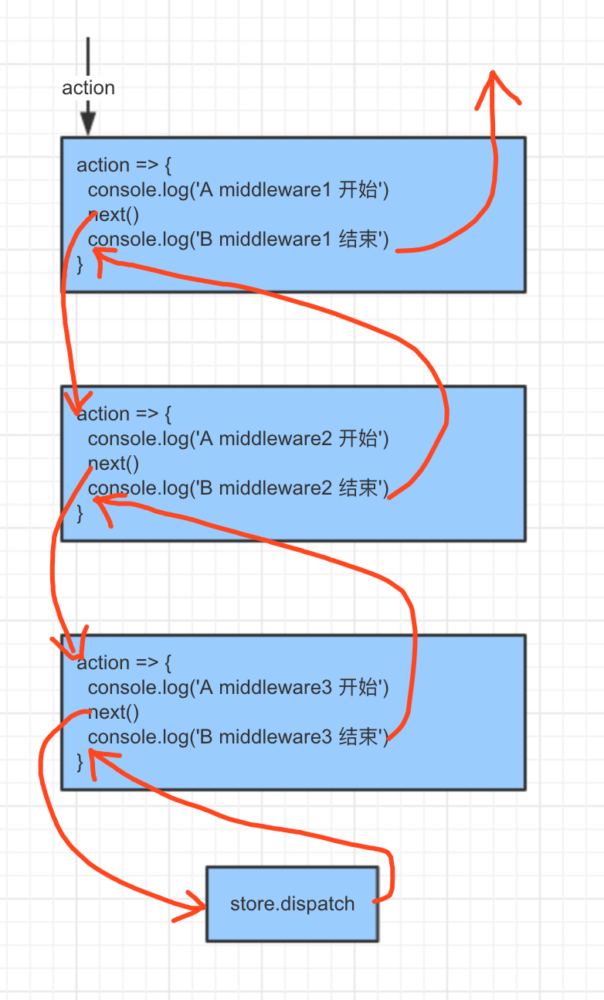

### 关于状态管理
react作为view层，一般不会操作dom，而是通过状态的改变来实现dom的修改
不用状态管理工具也是可以开发react的应用的，直接使用props和state
    - state是组件内的状态
    - props是组件外的状态
    - 数据流由外到内，事件执行时有内而外的，即在组件内部调用经props传入的函数，修改外部组件是state

### redux结合react-redux使用
[利用hook实现react-redux](./react-redux)
1. 最外层父组件利用redux.createStore创建全局store，利用<Provider>将store传入
    ```js
    let store = createStore(reducers);

    render(
        <Provider store={store}>
            <App />
        </Provider>,
        document.getElementById('root')
    )
    ```
1. reducer是用来更新状态的纯函数
    ```js
    const todos = (state = [], action) => {
        switch (action.type) {
            case 'ADD_TODO':
                return [
                    ...state,
                    {
                        id: action.id,
                    }
                ]
            default:
                return state
        }
    }

    export default todos
    ```
1. actioncreateor
    ```
    export const toggleTodo = id => {
        return {
            type: 'ADD_TODO',
            id
        }
    }
    ```
1. 容器组件，利用connect获取全局状态
    ```js
    const mapStateToProps = state => {
        return {
            todos: doSomething(state.todos)
        }
    };

    const mapDispatchToProps = dispatch => {
        return {
            onTodoClick: id => {
                dispatch(toggleTodo(id))
            }
        }
    };

    const VisibleTodoList = connect(
        mapStateToProps,
        mapDispatchToProps
    )(Component)
    ```

### redux源码分析
1. createStore
    最核心的api就是createStore
    ```js
    const createStore = (reducer, initialState ={}) => {
        // 当前state
        let state = initialState;
        // 当前订阅的listeners
        let listeners = [];
        // getstate用于获取当前的state
        const getState = () => state;
        // dispatch一个action，调用reducer生成一个新的state
        const dispatch = (action) => {
            state = reducer(state, action);
            listeners.forEach(l => l());
        };

        // sunscribe用于订阅一个listener
        // 返回一个函数，用于取消该listener订阅的unsubscribe函数
        const subscribe = (listener) => {
            listeners.push(listener);
            return () => {
                listeners = listeners.fileter(l => l !== listener)
            }
        };

        return {
            getState,
            dispatch, // 修改数据，消息发布
            subscribe // dispatch时触发，消息订阅，在connect生成的高级组件的componentDidMount方法中，利用subscribe传入执行setState的事件函数
        };
    }
    ```

1. combineReducers: 将多个reducer包裹成一个reducer，返回一个闭包reducer。reducer执行时，对每个reducer进行遍历执行，更新state
    ```js
    function combineReducers(reducers) {
        // 过滤掉非函数的属性,finalReducers为最终可用的reducer对象
        const finalReducerKeys = Object.keys(finalReducers);

        return function combination(state = {}, action) {
            let hasChanged = false;
            const nextState = {};
            for (let i = 0; i < finalReducerKeys.length; i++) {
                const key = finalReduceKeys[i];
                const reducer = finalReducers[key];
                const previousStateForKey = state[key];

                // 每个reduer遍历执行，只有action匹配上时才更新状态，否则返回原状态(每个子reducer自身的状态)
                const nextStateForKey = reducer(previousStateForKey, action);
                // 更新每个key下的state
                nextState[key] = nextStateForKey;
                hasChanged = hasChanged || nextStateForKey !== previousStateForKey; 
            }

            return hasChanged ? nextState : state;
        }
    ```

1. bindActionCreators(actionCreators, dispatch):bindActionCreators生成直接触发 action 的函数,对actionCreator用dispatch进行包装，直接调用
    ```js
    //  一个与原对象类似的对象，只不过这个对象的 value 都是会直接 dispatch 原 action creator 返回的结果的函数
    function bindActionCreators(actionCreators, dispatch) {
        // actionCreators为函数时
        if (typeof actionCreators === 'function') {
            return bindActionCreator(actionCreators, dispatch);
        }

        // actionCreators为对象
        const keys = Object.keys(actionCreators);
        const boundActionCreators = {};
        for (let i = 0; i < keys.length; i++) {
            const key = keys[i];
            const actionCreator = actionCreators[key];
            if (typeof actionCreator === 'function') {
                boundActionCreators[key] = bindActionCreator(actionCreator, dispatch);
            }
        }
        return boundActionCreators;
    }

    function bindActionCreator(actionCreator, dispatch) {
        return (...args) => dispatch(actionCreator(...args));
    }
    ```


1. applyMiddleware中间件实际就是扩展createStore
    1. 中间件函数签名为({dispatch, getState}) => next => action => {next(action)}
    ```js
    export default function applyMiddleware(...middlewares) {
        return createStore => (...args) => {
            const store = createStore(...args);
            // dispatch是一个匿名函数
            // 在后面生成最终的dispatch生成之前，调用的是假的dispatch
            let dispatch = () => {
                throw new Error(
                    `Dispatching while constructing your middleware is not allowed. ` +
                    `Other middleware would not be applied to this dispatch.`
                )
            };

            const middlewareApi = {
                getState: store.getState,
                dispatch: (...args) => dispatch(...args)
            };

            const middlewareChain = middlewares.map(middleware => middleware(middlewareApi));
            dispatch = compose(...middlewareChain)(store.dispatch);

            return {
                ...store,
                dispatch
            }
        }
    }
    ```
    1. 其实用过express也算了解中间件方式，但是这边函数式的写法容易头晕，就用实例来分析一下
        ```js
        const logger = (dispatch, getState) => next => action => {
            console.log('11before dispatch');
            next(action);
            console.log('11after dispatch');
        };
        const logger2 = (dispatch, getState) => next => action => {
            console.log('22before dispatch');
            next(action);
            console.log('22after dispatch');
        };

        const logger3 = (dispatch, getState) => next => action => {
            console.log('33before dispatch');
            next(action);
            console.log('33after dispatch');
        };
        const store = applyMiddleware(logger, logger2, logger3)(createStore)(reducers);

        // dispatch的结果
        // 11before dispatch
        // 22before dispatch
        // 33before dispatch
        // 33after dispatch
        // 22after dispatch
        // 11after dispatch
        ```
        利用中间件生成扩展的dispatch，执行dispatch(action)符合洋葱模型
        
    1. 上例中，如果第二种中间件没有用next(action)，执行结果为
        ```
        11before dispatch
        22before dispatch
        22after dispatch
        11after dispatch
        ```
        且不会修改store状态，因为没有将logger3中间件包裹生成的dispatch注入。从applyMiddleware参数来说，如果一个中间件没有用next(action)，那么这个中间件右边的中间件不会生效, 且store.dispatch也不会执行
    1. thunk，上面一通分析就是为了说下thunk的代码，action为函数时不会执行next，但是将dispatch注入了action函数内，然后这时传入dispatch的就不是函数了，重新走一遍中间件流程