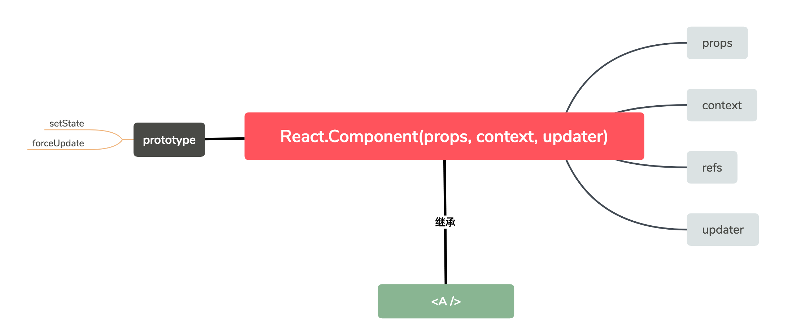
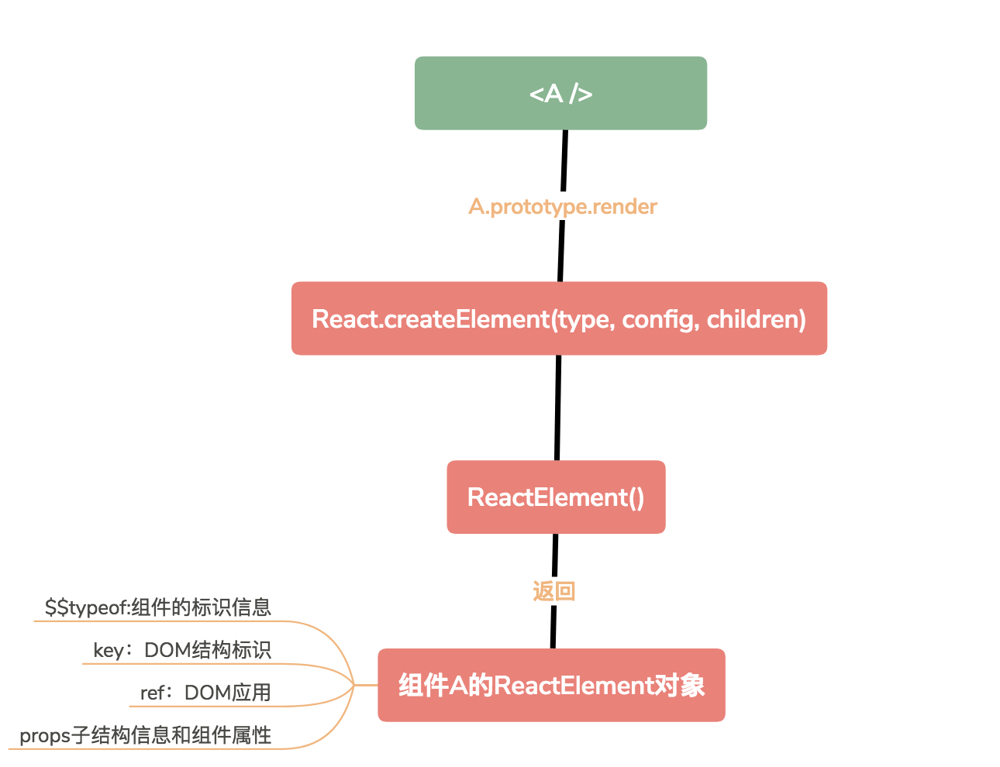

### 组件实现与挂载
首先看react提供的api
```js
var React = {
    Component: ReactComponent,
    createElement: createElement,
    createClass: ReactClass.createClass
};

//babel解析器令(ES6)import === (CommonJS)require
module.exports = React;
```
1. react组件
react组件其实是继承React.Component(也就是ReactComponent）类的子类，它的原型具有setState等方法
    ```js
    function ReactComponent(props, context, updater) {
        this.props = props;
        this.context = context;
        this.refs = emptyObject;
        this.updater = updater || ReactNoopUpdateQueue;
    };

    ReactComponent.prototype.setState = function() { 
        // ...
    };
    ReactComponent.prototype.forceUpdate = function() {
        // ...
    };
    module.exports = ReactComponent;
    ```
    
2. 组件的初始化
组件的render方法实际调用了React.createElement方法，其中又调用ReactElement方法
    ```js
    function createElement(type, config, children) {
        // ..
        return ReactElement(type, key, ref, self, source, ReactCurrentOwner.current, props);
    }

    // ReactElement是一种内部记录组件特征的类型，生成的对象也就是react组件
    var ReactElement = function(type, key, ref, self, source, owner, props) {
        var element = {
            $$typeof: REACT_ELEMENT_TYPE,// 组件的标识信息
            type: type,
            key: key,
            ref: ref,
            props: props,
            // _owner === ReactCurrentOwner.current,值为创建此元素的组件
            _owner: owner
        };
        return element;
    }
    ```
    
3. 组件挂载
组件的挂载是通过ReactDom.render(component, mountNode)将react组件挂载到页面
挂载流程：
    - 根据ReactDOM.render()传入不同的参数，React内部会创建四大类封装组件，记为componentInstance
    - 将componentInstance作为参数传入mountComponentIntoNode方法，由此获得组件对应的HTML，记为markup
    - 将真实DOM的innerHTML设为markup，即完成了DOM插入

ReactDOM.render方法的组件参数与输出的componentInstance关系如下
| node | 组件参数 |结果 |
| :--: | :--: | :--: |
| null/false | 空 | ReactEmptyComponent |
| object && type === string | 虚拟DOM | ReactDOMComponent |
|object && type !== string |React组件|ReactCompositeComponent|
|string|字符串|ReactTextComponent|
|number|数字|ReactTextComponent|

### 组件类型和生命周期
很显然，只有React挂载时才会有生命周期