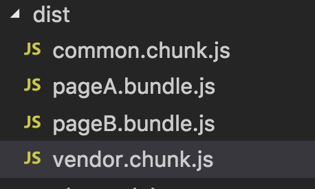

### 多页面场景
两个入口文件pageA.js、pageB.js
```
// module.js
export default "module";

// subPageA.js
import "./module";
export default "subPageA";

// subPageB.js
import "./module";
export default "subPageB";

// pageA.js
import "./subPageA";
import "./subPageB";
export default "pageA";

// pageB.js
import "./subPageA";
import "./subPageB";
export default "pageB";
```
### webpack配置
针对第三方库（例如lodash）通过设置priority来让其先被打包提取，最后再提取剩余代码
```
const webpack = require("webpack");
const path = require("path");

module.exports = {
    // 多页面应用
    entry: {
        pageA: "./src/pageA.js",
        pageB: "./src/pageB.js"
    },
    output: {
        path: path.resolve(__dirname, "dist"),
        filename: "[name].bundle.js",
        // 非入口文件
        chunkFilename: "[name].chunk.js"
    },
    optimization: {
        splitChunks: {
            cacheGroups: {
                // 注意: priority属性
                // 其次: 打包业务中公共代码
                common: {
                    name: "common",
                    chunks: "all",
                    minSize: 1,
                    priority: 0
                },
                    // 首先: 打包node_modules中的文件,也就是加载的第三方库
                vendor: {
                    name: "vendor",
                    test: /[\\/]node_modules[\\/]/,
                    chunks: "all",
                    priority: 10
                }
            }
        }
    }
};
```

### 打包结果
