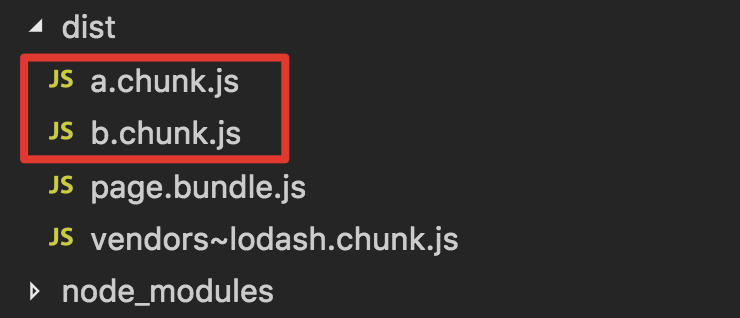

单页面的代码分割和懒加载不是通过webpack配置来实现的，而是通过webpack的写法和内置函数实现的。
目前webpack针对此项功能提供 2 种函数：
    - import(): 引入并且自动执行相关 js 代码
    - require.ensure(): 引入但需要手动执行相关 js 代码

### 单页面场景
page.js是入口文件,subPageA.js和subPageB.js共同引用module.js
```
// module.js
export default "module";

// subPageA.js
import "./module";
console.log("I'm subPageA");
export default "subPageA";

// subPageB.js
import "./module";
console.log("I'm subPageB");
export default "subPageB";
```

### 配置文件
```
const webpack = require("webpack");
const path = require("path");

module.exports = {
    entry: {
        page: "./src/page.js"
    },
    output: {
        publicPath: __dirname + "/dist/",
        path: path.resolve(__dirname, "dist"),
        filename: "[name].bundle.js",
        chunkFilename: "[name].chunk.js"
    }
};
```

### import
import()可以通过注释的方法来指定打包后的 chunk 的名字
```
// page.js
import(/* webpackChunkName: 'a'*/ "./subPageA").then(function(subPageA) {
    console.log(subPageA);
});

import(/* webpackChunkName: 'b'*/ "./subPageB").then(function(subPageB) {
    console.log(subPageB);
});

import(/* webpackChunkName: 'lodash'*/ "lodash").then(function(_) {
    console.log(_.join(["1", "2"]));
});
export default "page";
```

### 打包结果


### 使用less
安装
```
npm install --save-dev less less-loader
```