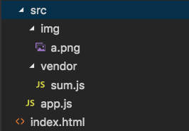
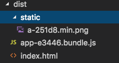

每次都要自己将打包好的文件插入到html中太不科学， 应该是自动生成完整的index.html，例如静态资源、js 脚本都被自动插入
### 入口文件
```
// src/vendor/sum.js
export function sum(a, b) {
    return a + b;
}


// src/app.js
import {sum} from "./vendor/sum";
console.log("1 + 2 =", sum(1, 2));
```

### html模板
```
<!-- index.html -->
<!DOCTYPE html>
<html lang="en">
<head>
    <meta charset="UTF-8">
    <meta name="viewport" content="width=device-width, initial-scale=1.0">
    <meta http-equiv="X-UA-Compatible" content="ie=edge">
    <title>Document</title>
</head>
<body>
    <div></div>
    
</body>
</html>
```

目录结构


### webpack配置
先用url-loader处理图片，然后html-loader处理 html 文件中的标签和属性
HtmlWebpackPlugin常用参数含义如下：
    - filename：打包后的 html 文件名称
    - template：模板文件（例子源码中根目录下的 index.html）
    - chunks：和entry配置中相匹配，支持多页面、多入口
    - minify.collapseWhitespace：压缩选项
```
const path = require("path");
const webpack = require("webpack");
const HtmlWebpackPlugin = require("html-webpack-plugin");

module.exports = {
    entry: {
        app: "./src/app.js"
    },
    output: {
        publicPath: __dirname + "/dist/",
        path: path.resolve(__dirname, "dist"),
        filename: "[name]-[hash:5].bundle.js",
        chunkFilename: "[name]-[hash:5].chunk.js"
    },
    module: {
        rules: [
            {
                test: /\.html$/,
                use: [
                {
                    loader: "html-loader",
                    options: {
                    attrs: ["img:src"]
                    }
                }
                ]
            },
            {
                test: /\.(png|jpg|jpeg|gif)$/,
                use: [
                    {
                        loader: "url-loader",
                        options: {
                            name: "[name]-[hash:5].min.[ext]",
                            limit: 10000, // size <= 20KB
                            publicPath: "static/",
                            outputPath: "static/"
                        }
                    }
                ]
            }
        ]
    },
    plugins: [
        new HtmlWebpackPlugin({
            filename: "index.html",
            template: "./index.html",
            chunks: ["app"], // entry中的app入口才会被打包
            minify: {
                // 压缩选项
                collapseWhitespace: true
            }
        })
    ]
};
```

打包结果
